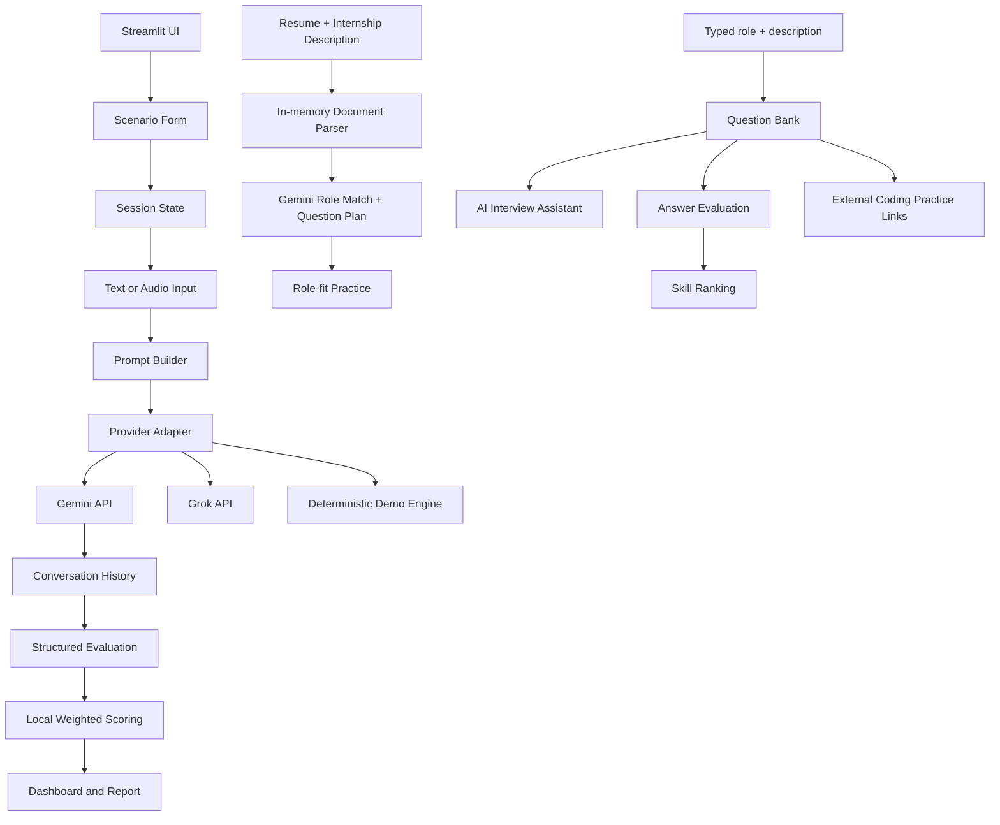

# CareerCoach AI

> `careercoach_ai :: universal interview readiness lab`

**Live app:** [CareerCoach AI on Streamlit Community Cloud](https://jgf2buajk339fxdmuofnnr.streamlit.app/)

**GitHub:** [Himanshu90909/careercoach-ai](https://github.com/Himanshu90909/careercoach-ai)

CareerCoach AI is an open-source, Grok-grounded interview-preparation workspace built with Streamlit. It uses the xAI Grok API for live role-specific coaching and provides a deterministic local demo mode when no key is configured. It accepts any role or internship description as text, can compare a resume with the role, generates requirement-grounded interview questions, provides an AI interview assistant, evaluates written answers, ranks demonstrated skills, and links candidates to external coding-practice platforms.

## Why this project exists

Students often know their technical skills but have not rehearsed how to communicate value, justify a target amount, or respond to a constrained offer. CareerCoach AI turns that difficult conversation into a repeatable practice loop: configure a scenario, negotiate, review the scorecard, and practise again.

## Features

The application provides three preparation paths: a salary negotiation room, a universal **Interview workspace** with text-based role setup, and a **Role-fit practice** page for resume and internship-description uploads. The sidebar includes an explicit session reset/start control and an AI provider selector. The interview workspace generates behavioral, technical, project, role-fit, teamwork, learning, coding, SQL, system-design, and communication questions; supports an AI assistant chat; evaluates written answers; visualizes demonstrated skill ranks; and recommends LeetCode, HackerRank, CodeSignal, and GeeksforGeeks practice. Deterministic fallbacks keep the workflow usable without an API key.

## Architecture



## Run locally

```bash
git clone <your-repository-url>
cd careercoach-ai
python -m venv .venv
source .venv/bin/activate
pip install -r requirements.txt
streamlit run app.py
```

The app opens in the **Interview workspace** and defaults to Grok. If `GROK_API_KEY` is absent, the sidebar clearly shows the issue and Demo mode remains available. Configure Grok locally through `.streamlit/secrets.toml`:

```toml
GROK_API_KEY = "your-grok-key"
GROK_MODEL = "grok-3-mini"
GROK_BASE_URL = "https://api.x.ai/v1"
```

Never commit secrets. The included `.gitignore` excludes `.streamlit/secrets.toml`. The Grok adapter uses the OpenAI-compatible xAI `/chat/completions` endpoint. The sidebar also accepts a temporary session key, but deployment Secrets are recommended.

## Deploy to Streamlit Community Cloud

Create a new app from the GitHub repository, set the main file to `app.py`, and add the following secret in the app settings:

```toml
GEMINI_API_KEY = "your-key-here"
```

The project uses only Python packages declared in `requirements.txt` and does not require local system dependencies.

## Project structure

| Path | Responsibility |
|---|---|
| `app.py` | Streamlit UI, navigation, session state, charts, and interaction flow |
| `modules/ai_engine.py` | Gemini/Grok provider adapter, question generation, assistant chat, answer scoring, role matching, coaching, and demo fallbacks |
| `modules/prompts.py` | Dynamic negotiation, role-matching, question-bank, assistant, and answer-evaluation prompts |
| `modules/document_parser.py` | In-memory PDF, DOCX, TXT, Markdown, and CSV text extraction |
| `modules/scoring.py` | Deterministic score normalisation and weighted scoring |
| `modules/report_generator.py` | Downloadable Markdown report generation |
| `tests/` | Unit tests for scoring, parsing, and role matching |
| `docs/architecture.md` | Technical design, data flow, API strategy, and deployment explanation |
| `docs/capstone_rubric.md` | Official MirAI rubric mapping, demo sequence, and submission checklist |

## Evaluation rubric coverage

| Requirement | Implementation |
|---|---|
| Streamlit forms and session state | Scenario setup uses `st.form`; active conversation is preserved in `st.session_state` |
| Grok integration | Role-grounded HR, evaluation, role-match, question generation, assistant, and answer-coaching prompts routed through xAI Grok |
| Multimodality | Typed role descriptions, resume/job-document uploads, and `st.audio_input` voice practice with a text fallback |
| Data visualisation | KPI cards, radar profile, horizontal scorecards, answer scores, and demonstrated-skill ranking |
| Deployment | Streamlit Community Cloud-compatible requirements and secure user-configurable Grok secrets |
| Open-source branding | Terminal-style title, architecture diagram, setup instructions, and documented modules |

## MirAI capstone evaluation mapping

| Category | Max points | Repository evidence |
|---|---:|---|
| Technical implementation & architecture | 25 | Modular Python, `st.session_state`, `st.form`, Pandas pipelines, defensive AI parsing, deterministic fallbacks, and automated tests. |
| AI integration & prompt engineering | 20 | Gemini system prompts, dynamic role context, structured JSON tasks, resume matching, assistant chat, `st.camera_input`, and `st.audio_input`. |
| UI/UX & data visualization | 20 | Terminal-style dashboard, columns, expanders, KPI cards, Plotly charts, `st.data_editor`, uploads, and downloads. |
| Deployment & cloud engineering | 15 | Streamlit Community Cloud deployment, public GitHub repository, and dependency-only `requirements.txt`. |
| Open-source branding | 10 | Customized README, live link, setup instructions, architecture diagram, testing commands, and documented modules. |
| System design & documentation | 10 | `docs/architecture.md` plus the Mermaid data-flow diagram and API/fallback strategy. |

For the detailed evidence and final presentation sequence, see [`docs/capstone_rubric.md`](docs/capstone_rubric.md).

## Testing

```bash
pytest -q
python -m py_compile app.py modules/*.py
```

## Responsible-use note

This is an educational practice tool. Its salary values and feedback are simulated and should not be treated as financial, legal, or employment advice.
