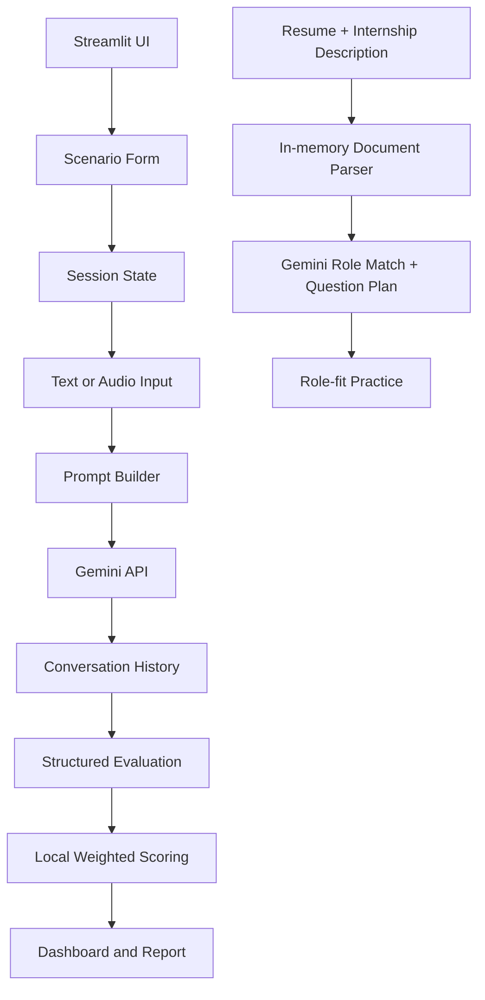

# CareerCoach AI

> `careercoach_ai :: voice-driven salary negotiation simulator`

CareerCoach AI is an internship and placement preparation tool built with Streamlit and Gemini. It simulates a demanding HR manager, lets a candidate practise a negotiation by text or microphone, and produces a scorecard with targeted coaching recommendations. The role-fit lab accepts a resume and internship description, compares them, and generates personalized interview questions and answer feedback.

## Why this project exists

Students often know their technical skills but have not rehearsed how to communicate value, justify a target amount, or respond to a constrained offer. CareerCoach AI turns that difficult conversation into a repeatable practice loop: configure a scenario, negotiate, review the scorecard, and practise again.

## Features

The application provides a scenario configuration form, role-specific HR prompts, session-state conversation memory, text and microphone input, structured six-dimension evaluation, interactive Plotly charts, and a downloadable Markdown coaching report. The **Role-fit practice** page supports PDF, DOCX, TXT, Markdown, and CSV uploads, produces a match score, highlights matched and missing skills, and lets the candidate practise targeted questions with STAR-style coaching feedback. It also includes deterministic demo modes, so the interface can be explored without an API key.

## Architecture



## Run locally

```bash
git clone <your-repository-url>
cd careercoach-ai
python -m venv .venv
source .venv/bin/activate
pip install -r requirements.txt
streamlit run app.py
```

The app starts in **demo mode** if `GEMINI_API_KEY` is absent. To enable live Gemini responses, create `.streamlit/secrets.toml` locally:

```toml
GEMINI_API_KEY = "your-key-here"
```

Never commit that file. The included `.gitignore` excludes it.

## Deploy to Streamlit Community Cloud

Create a new app from the GitHub repository, set the main file to `app.py`, and add the following secret in the app settings:

```toml
GEMINI_API_KEY = "your-key-here"
```

The project uses only Python packages declared in `requirements.txt` and does not require local system dependencies.

## Project structure

| Path | Responsibility |
|---|---|
| `app.py` | Streamlit UI, navigation, session state, charts, and interaction flow |
| `modules/ai_engine.py` | Gemini client, structured parsing, role matching, coaching, and demo fallbacks |
| `modules/prompts.py` | Dynamic negotiation, role-matching, and coaching prompts |
| `modules/document_parser.py` | In-memory PDF, DOCX, TXT, Markdown, and CSV text extraction |
| `modules/scoring.py` | Deterministic score normalisation and weighted scoring |
| `modules/report_generator.py` | Downloadable Markdown report generation |
| `tests/` | Unit tests for scoring, parsing, and role matching |
| `docs/architecture.md` | Technical design and data-flow explanation |

## Evaluation rubric coverage

| Requirement | Implementation |
|---|---|
| Streamlit forms and session state | Scenario setup uses `st.form`; active conversation is preserved in `st.session_state` |
| Gemini integration | Role-specific HR, evaluation, role-match, and answer-coaching prompts |
| Multimodality | Resume and internship-document uploads plus `st.audio_input` voice practice with a text fallback |
| Data visualisation | KPI cards, radar profile, horizontal scorecard, and transcript review |
| Deployment | Streamlit Community Cloud-compatible requirements |
| Open-source branding | Terminal-style title, architecture diagram, setup instructions, and documented modules |

## Testing

```bash
pytest -q
python -m py_compile app.py modules/*.py
```

## Responsible-use note

This is an educational practice tool. Its salary values and feedback are simulated and should not be treated as financial, legal, or employment advice.
