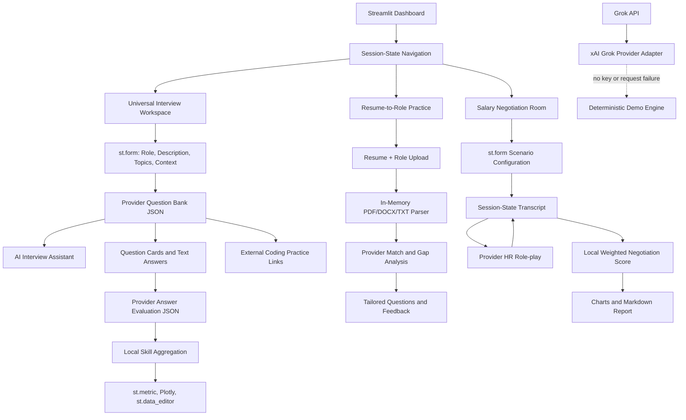

# CareerCoach AI Technical Architecture

## System purpose

CareerCoach AI is a modular Streamlit application centered on the xAI Grok API for general interview preparation, role-fit analysis, and salary-negotiation rehearsal. Demo mode is retained only as a deterministic local fallback when no Grok key is available. The same interface supports a student preparing for an internship, a fresher preparing for placement, or an experienced candidate preparing for a technical, behavioral, or compensation conversation.

## System flow

## Data flow and state design

The interview setup is submitted through `st.form`, which prevents partial widget changes from triggering unnecessary model calls. On submission, the role, description, selected topics, and optional candidate context are stored in `st.session_state`. The generated question bank is also stored there, so navigation and widget reruns do not erase the active practice plan. The sidebar provides an explicit **Start a fresh session** action that clears negotiation, assistant, question-bank, and evaluation state before rerunning the app.

Each answer evaluation is stored by question index in `answer_evaluations`. The application aggregates the returned `skill_scores` locally and calculates the demonstrated-skill ranking with Pandas. Plotly renders the ranking visually, while `st.data_editor` presents the same DataFrame as a rubric-friendly interactive table.

The role-fit workflow uses `st.file_uploader`. Uploaded PDF, DOCX, TXT, Markdown, or CSV content is extracted in memory and compacted before it reaches the AI prompt. The application does not persist the source documents. The salary-negotiation workflow uses a separate transcript list and evaluation object, allowing the original capstone scenario to remain independently demonstrable.

## AI integration strategy

`modules/prompts.py` contains explicit system-oriented prompt builders. Dynamic role, description, topic, candidate, transcript, question, and answer context is injected with f-strings. Structured tasks request JSON with known keys, and `AIEngine._parse_json` defensively extracts JSON when a model wraps it in Markdown. The Grok adapter uses the OpenAI-compatible xAI chat-completions endpoint. Question generation requires a `requirement_basis` for each question; invalid or generic provider output is rejected. Provider failures are recorded in a redacted diagnostic field and the local fallback is clearly labeled.

The AI engine exposes separate methods for HR role-play, negotiation evaluation, resume matching, tailored role-fit coaching, question-bank generation, assistant chat, and answer evaluation. This separation prevents a generic chatbot prompt from being reused for unrelated tasks.

## Module responsibilities

| Module | Responsibility |
|---|---|
| `app.py` | Streamlit presentation layer, navigation, forms, uploads, state transitions, charts, tables, and downloads. |
| `modules/prompts.py` | Dynamic prompts for negotiation, role matching, question generation, assistant chat, and answer evaluation. |
| `modules/ai_engine.py` | Gemini/Grok provider adapter, structured parsing, task-specific AI methods, and deterministic fallbacks. |
| `modules/document_parser.py` | In-memory extraction for PDF, DOCX, TXT, Markdown, and CSV uploads. |
| `modules/scoring.py` | Deterministic normalization, weighted scoring, best/worst dimensions, and deltas. |
| `modules/report_generator.py` | Downloadable Markdown coaching report generation. |
| `tests/` | Automated checks for scoring, document parsing, and demo role matching. |

## Security and reliability

The Grok key is read from the active sidebar session, `GROK_API_KEY`, or Streamlit secrets and is never embedded in source code. Error diagnostics redact the configured key before display. Uploaded candidate documents are processed in memory and are not committed to the repository. API failures are caught at the AI boundary, while local score aggregation remains reproducible. The application is educational and does not provide financial, legal, employment, or hiring decisions.

## Deployment

The application is compatible with Streamlit Community Cloud. The main file is `app.py`; all Python dependencies are declared in `requirements.txt`, and no local system packages are required. Add `GROK_API_KEY`, `GROK_MODEL`, and optionally `GROK_BASE_URL` through the deployment Secrets panel to activate live responses. Without a key, the deterministic demo engine provides a complete presentation path for the capstone evaluation.
